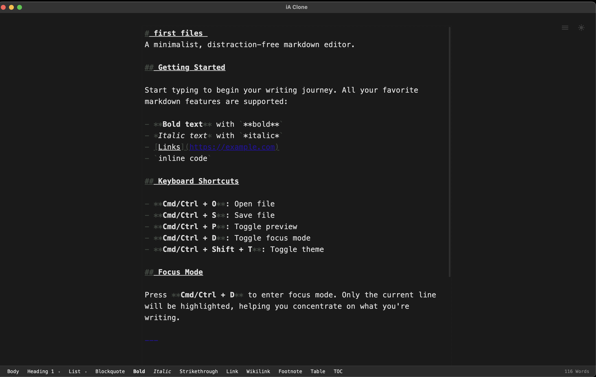

# iA Clone

A minimalist, distraction-free markdown writing app built with Tauri and Rust.



## Features

### Core Writing Experience
- **Distraction-Free Writing**: Clean, centered layout with no unnecessary UI elements
- **Live Markdown Preview**: Side-by-side preview with synchronized scrolling (Cmd/Ctrl + P)
- **Light & Dark Themes**: System-aware themes with manual toggle (Cmd/Ctrl + Shift + T)
- **Keyboard-First**: All features accessible via keyboard shortcuts

### Formatting Toolbar
Rich markdown formatting options available via toolbar at the bottom:
- **Block Formatting**: Headings (H1-H6), blockquotes, bullet lists, numbered lists
- **Inline Formatting**: Bold, italic, strikethrough
- **Links**: Standard links, wikilinks `[[page]]`
- **Advanced Elements**: Footnotes, tables, table of contents

### Advanced Focus Modes
Multiple focus modes to enhance concentration (Cmd/Ctrl + D):
- **Sentence Focus**: Highlights only the current sentence
- **Paragraph Focus**: Highlights only the current paragraph
- **Typewriter Mode**: Keeps cursor vertically centered while typing

### Writing Assistant
Intelligent style checking to improve your writing:
- **Filler Words**: Detects overused words like "very", "really", "just", "actually"
- **Clichés**: Identifies common clichés and tired phrases
- **Redundancies**: Highlights redundant expressions like "advance planning", "end result"

### Smart Features
- **Auto-Save**: Automatic draft saving to localStorage
- **Smart Filenames**: Suggests filename from your first H1 heading
- **File Operations**: Open, save, and manage markdown files with native dialogs
- **Word Statistics**: Real-time word count display

## Tech Stack

- **Backend**: Rust with Tauri 2.x (~3MB installer)
- **Frontend**: Vanilla JavaScript (no framework bloat)
- **Editor**: CodeMirror 6 with markdown support
- **Markdown**: marked.js for fast parsing
- **Typography**: Monospace font optimized for writing

## Installation

### Prerequisites

- Node.js (v18 or higher)
- Rust (latest stable)
- Platform-specific dependencies:
  - **macOS**: Xcode Command Line Tools
  - **Linux**: `webkit2gtk`, `libssl-dev`, `libgtk-3-dev`, `libayatana-appindicator3-dev`, `librsvg2-dev`
  - **Windows**: WebView2 (usually pre-installed)

### Build from Source

```bash
# Install dependencies
npm install

# Run in development mode
npm run dev

# Build for production
npm run build
```

The built app will be in `src-tauri/target/release/bundle/`.

### macOS: “is damaged and can’t be opened”

The `docs/iA-Clone.dmg` currently contains an app that is **not notarized** (Gatekeeper may show “iA Clone is damaged…” after download).

After dragging the app into `/Applications`, remove the quarantine attribute and try again:

```bash
xattr -cr "/Applications/iA Clone.app"
```

## Keyboard Shortcuts

### File Operations
| Shortcut | Action |
|----------|--------|
| `Cmd/Ctrl + N` | New file |
| `Cmd/Ctrl + O` | Open file |
| `Cmd/Ctrl + S` | Save file |
| `Cmd/Ctrl + Shift + S` | Save as |

### Formatting
| Shortcut | Action |
|----------|--------|
| `Cmd/Ctrl + B` | Bold |
| `Cmd/Ctrl + I` | Italic |
| `Cmd/Ctrl + K` | Insert link |
| `Cmd/Ctrl + Shift + X` | Strikethrough |

### View
| Shortcut | Action |
|----------|--------|
| `Cmd/Ctrl + P` | Toggle preview |
| `Cmd/Ctrl + D` | Toggle focus mode |
| `Cmd/Ctrl + Shift + T` | Toggle theme |

## View Options Menu

Access the View Options menu via the button in the top-left corner for advanced writing features:

### Focus Modes
Choose from three different focus modes to minimize distractions:
- **Sentence**: Dims everything except the current sentence
- **Paragraph**: Dims everything except the current paragraph  
- **Typewriter**: Keeps the cursor centered vertically as you type

### Style Check
Enable writing assistance to improve your prose:
- **Fillers**: Highlights filler words (very, really, just, actually, basically, etc.)
- **Clichés**: Detects overused phrases ("at the end of the day", "think outside the box", etc.)
- **Redundancies**: Identifies redundant expressions ("advance planning", "past history", etc.)
- **Custom**: Add your own custom style rules

### Authors
Toggle visibility of different author contributions:
- **Human**: Show human-written content
- **Other**: Show AI or other sources

## Project Structure

```
iAclone/
├── src/                    # Frontend
│   ├── index.html         # Main app shell
│   ├── styles/            # CSS files
│   │   ├── main.css       # Core layout
│   │   ├── themes.css     # Light/dark themes
│   │   ├── editor.css     # Editor styling
│   │   └── focus.css      # Focus mode
│   └── js/                # JavaScript modules
│       ├── app.js         # Main app logic
│       ├── editor.js      # CodeMirror setup
│       ├── preview.js     # Markdown preview
│       └── focus.js       # Focus mode
├── src-tauri/             # Rust backend
│   ├── src/
│   │   ├── main.rs        # Entry point
│   │   └── lib.rs         # File I/O commands
│   ├── Cargo.toml         # Rust dependencies
│   └── tauri.conf.json    # App configuration
├── dev-server.js          # Development HTTP server
└── package.json           # Node dependencies
```

## Development

### Running in Development Mode

```bash
npm run dev
```

This will:
- Start Vite dev server on port 5500
- Launch the Tauri app
- Enable hot-reload for all changes

### Testing

```bash
# Run all tests (frontend + backend)
npm run test:all

# Frontend tests only
npm test

# Backend tests only
npm run test:rust

# Watch mode (auto-rerun on changes)
npm run test:watch

# Coverage report
npm run test:coverage
```

### Building for Production

```bash
npm run build
```

This creates optimized bundles for your platform in `src-tauri/target/release/bundle/`.

## Design Philosophy

iA Clone follows the principles of minimalist design:

1. **Content First**: The writing experience is paramount
2. **No Distractions**: UI elements fade away when not needed
3. **Beautiful Typography**: Monospace font with generous spacing
4. **Fast & Lightweight**: Native performance with tiny bundle size
5. **Keyboard-Driven**: Power users can work without touching the mouse

## License

MIT

## Acknowledgments

Inspired by [iA Writer](https://ia.net/writer) - one of the best writing apps ever made.

